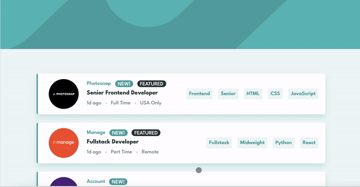

<p align="center">
  
</p>

# Frontend Mentor - Job listings with filtering solution

This is a solution to the [Job listings with filtering challenge on Frontend Mentor](https://www.frontendmentor.io/challenges/job-listings-with-filtering-ivstIPCt). Frontend Mentor challenges help you improve your coding skills by building realistic projects.

## Table of contents

- [Overview](#overview)
  - [The challenge](#the-challenge)
  - [Links](#links)
  - [Setup](#setup)
- [My process](#my-process)
  - [Built with](#built-with)
  - [What I learned](#what-i-learned)
  - [Useful resources](#useful-resources)

## Overview

### The challenge

Users should be able to:

- View the optimal layout for the site depending on their device's screen size
- See hover states for all interactive elements on the page
- Filter job listings based on the categories

### Links

- [Solution on Frontend Mentor](https://www.frontendmentor.io/challenges/job-listings-with-filtering-ivstIPCt/solutions/new)
- [Live Site](https://job-listings-fem-challenge.netlify.app/)

### Setup

To run this project, install it locally and launch it with the following commands:

```
$ npm install
$ npm run dev
```

## My process

I started by defining the styles in the Tailwind config file, then scaffolded the components.
Then I styled the components starting with the header background, search bar, clear button, and individual listings, applying responsiveness along.

Now, I hit some walls when it came to functionality.

Firstly, I actually had a wrong understanding of how the app should work. Somehow I thought that the user had to type the name of a filter in the search bar, which would create the filter tags simultaneously and that the filtering would be done after typing Enter. So I refactored my search bar from an input to a textarea element, even had it auto resize etc, to eventually realise I misunderstood how the user was supposed to interact with the app. Once I did realise this though, it made the project that much easier.

Secondly, I realise a bit late that I would need an id coupled with each filter in order to be able to remove them individually. Here is where it got confusing: the id attached to each listing in the provided data array can't be used, because that's the id of the listing itself, not the filter - which can be shared across multiple listings. I ended up creating a new array just for the filters and their id. The result looks like this:

```js
const FilterButton: React.FC<FilterButtonProps> = ({ filter, addFilters }) => {

  const addFilters = (e: React.MouseEvent<HTMLButtonElement, MouseEvent>) => {
    let value = e.currentTarget.innerHTML.toLowerCase() as keyof typeof filtersList
    let title = filtersList[value].title
    let id = filtersList[value].id
    const filter = { id, title }

    if (!filters.some(filter => filter.title === title)) {
      setFilters((prevFilters) => [...prevFilters, filter])
    }
  }

    return (
        <button onClick={(e) => addFilters(e)}>
            {filter}
        </button>
    )
}
```

Finally, I spent a looot of time on the filtering function because I was under the impression that my first approach, which is the one I went with at the end, wasn't working properly. Then I started getting lost with `useEffect`, `useMemo`, initialising various states, getting infinite loops... A lot of wasted time here to in the end go back to my first solution, which worked fine. If you omit that I was also stuck there due to forgetting to `return` the results of the `some` array method.

I finsihed up by adding some transitions. I first tried with HeadlessUI but wasn't able to make that work. Then I discovered React Transition Group which was fairly easy to implement.

### Built with

- Semantic HTML5 markup
- [React](https://reactjs.org/)
- [TypeScript](https://www.typescriptlang.org/)
- [TailwindCSS](https://tailwindcss.com/)
- [React Transition Group](https://reactcommunity.org/react-transition-group/)
- [Vite](https://vitejs.dev/)

### What I learned

I learned first and foremost that I should take more time to prepare what (all) the requirements of the project are, and to make sure I fully understand how the user is expected to interact with the app.

Other areas where I have learned:

- How to set up a React app with Vite - so much simpler, I will probably never go back to create-react-app
- TailwindCSS and React Transition group: both tools I had never used before and now am confident in using them more
- I also felt like I made major progress with my TypeScript skills in this app. When I look back at how super confusing I found it before, I'm now quite comfortable with it, without getting too fancy.
- Much about filtering lists of course, and that it can be done without bells and whistles (for a limited list of results like this at least). This is how the function at the core of this project looks like:

```js
const getFilteredResults = (): Array<ListingType> => {
  const results = listings.filter((listing: any) => {
    return filters.some((filter) => {
      const allFilters = [
        listing.role,
        listing.level,
        ...listing.languages,
        ...listing.tools,
      ]
      return allFilters.includes(filter.title)
    })
  })
  return filters.length === 0 ? listings : results
}

const filteredListings = getFilteredResults()
```

### Useful resources

- [Tailwind course by NetNinja](https://www.youtube.com/playlist?list=PL4cUxeGkcC9gpXORlEHjc5bgnIi5HEGhw) - Helped me set solid bases with tailwind before starting this project!
- [You Might Not Need an Effect](https://react.dev/learn/you-might-not-need-an-effect) - This page from the React docs set me on the right path to approach the filtering function.
- [How to Check If an Array Includes an Object in JavaScript](https://www.tutorialrepublic.com/faq/how-to-check-if-an-array-includes-an-object-in-javascript.php) - Was useful when crafting the `addFilters` function!
- [How to dynamically access object property in TypeScript](https://stackoverflow.com/a/62438434/14697954) - A SO answer that was extremely valuable for my `addFilters` function.
- [Jack Tubbenhauer's solution on this other Frontend Mentor project](https://github.com/jtubbenhauer/fm-time-tracking) - This was really helpful to get a better understanding at how to use TypeScript with React!
